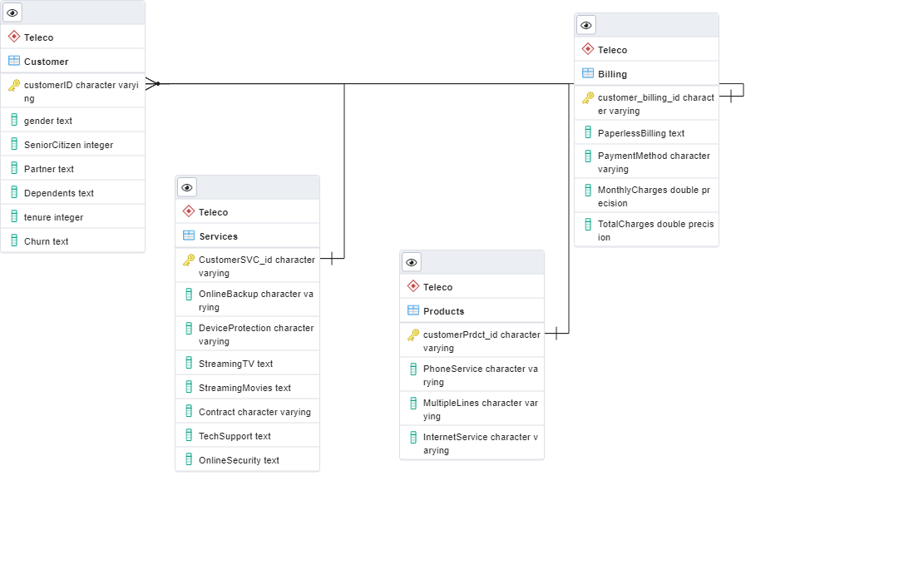

# Telco Customer Predictive Analysis

## Project Overview

Telco, a telecommunications company, has assigned us to perform a predictive analysis based on established data, with the goal of identifying future customer churn trends. In addition to the historical data, we will use statistical algorithms and build predictive models to identify the probability of future outcomes. We will present our findings with a Google dashboard displaying various types of pragmatic visualization in order to comprehensively convey our results. This analysis will provide Telco with the necessary insights to improve upon the current marketing and operational processes, reduce customer churn, and increase profits.
<!-- ## specify if one or multiple algorithms are used -->

## Presentation

- <ins>Topic:<ins>

  Telco Customer Predictive Analysis
  
- <ins>Reason for topic selection:<ins>

  Interests in marketing, customer relations, and sales.

- <ins> Question to answer: <ins>

  What is the likelihood of future customer churn?
  <!-- ##- What customers are more likely to change companies? -->
  <!-- ##- What customers are less likely to change companies? -->
  <!-- ##- How to reduce customer churn? -->
- <ins> Benefits of the analysis:<ins>
  - Marketing optimization 
  - Operational improvement
  - Cost reduction

- <ins>Customer churn definition:<ins>

  In layman’s terms, customer churn is the percentage of customers who have stopped using the company’s products and services over a specified amount of time.

- <ins> Data exploration:<ins>
	
	- Variables: Gender, Senior Citizen, Partner, Dependents, Tenure, Phone Service, Multiple Lines, Internet Service, Online Security,   Online Backup, Device Protection,  Tech Support, Streaming TV,  Streaming Movies,   Contract,  Paperless Billing  ,  Payment Method,                 Monthly Charges, Total Charges, Churn
  - Data types: Objects and Integers
  - Response variable: Churn	
  - Variable transformations: Categorical encoding,  conversion of objects to integers

- <ins> Data analysis: <ins>

  -	Models: Logistic Regression, Decision Tree, XGBoost
  -	Training and Testing sets: split randomly with 70-30 ratio

## Dashboard
[Google Slides](https://docs.google.com/presentation/d/1a7xHa3yW0jl9KiDPbGxgLm1qyTQPn5KVI-QT3nqyuqM/edit?usp=sharing)

## Resources
- Data Source: [WA_Fn-UseC_-Telco-Customer-Churn.csv](https://github.com/UCF-Data-Analytics-Group-Project/Final_Project/blob/Cindy_T/WA_Fn-UseC_-Telco-Customer-Churn.csv)
-	Software: Pandas Library, Matplotlib, Numpy, Plotly, PostgreSQL, Python, Scikitlearn, Sqlalchemy, Tableau

## Team Details

- <ins>Communication protocol:<ins>
  - Team members only communication channels: SMS messages, Slack, Zoom
  - Project management tool: Jira 
  - Contact information shared: individual mobile phone numbers and email addresses
  - Regularly scheduled meetings 	
- <ins>Segment 2 roles and responsibilities:<ins>

  - :red_square: Cindy-GitHub, README.md
  - :small_red_triangle: Hunter-Simple machine learning model
  - :red_circle: Husam- Mockup database
  - :x: Christ-Presentation, technology	

<!-- ## Results -->
<!-- ## Summary -->

