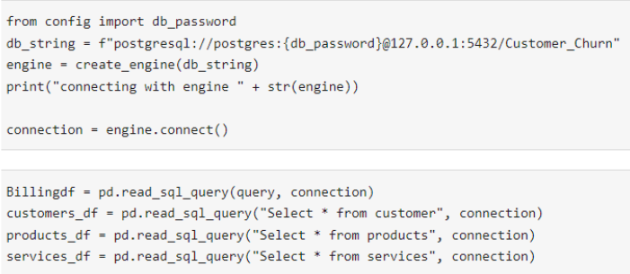
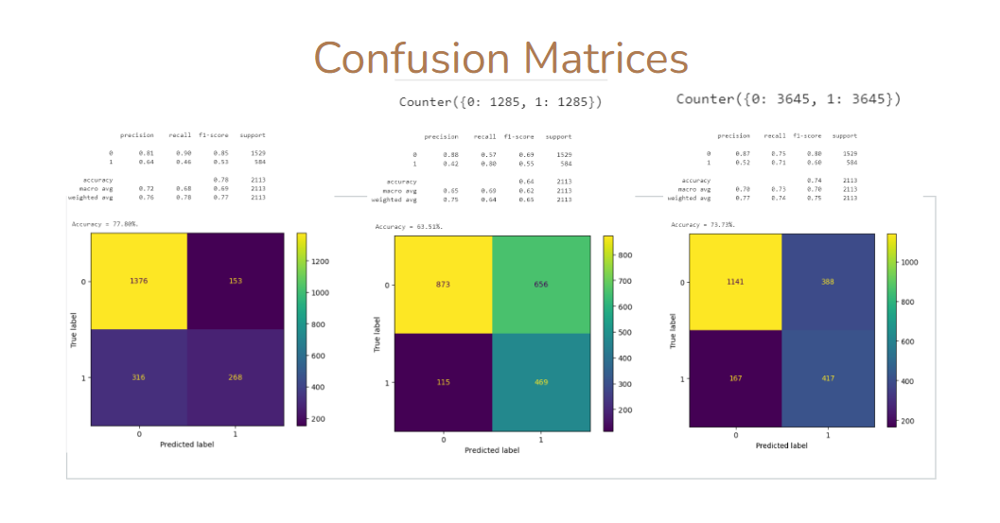
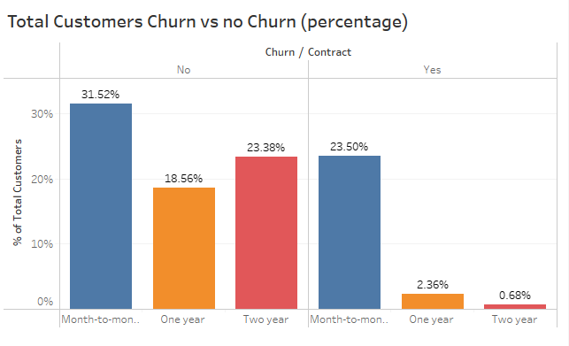
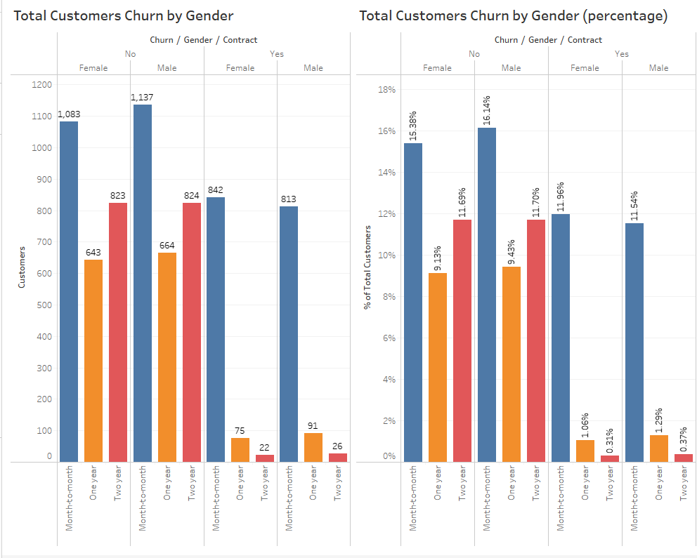
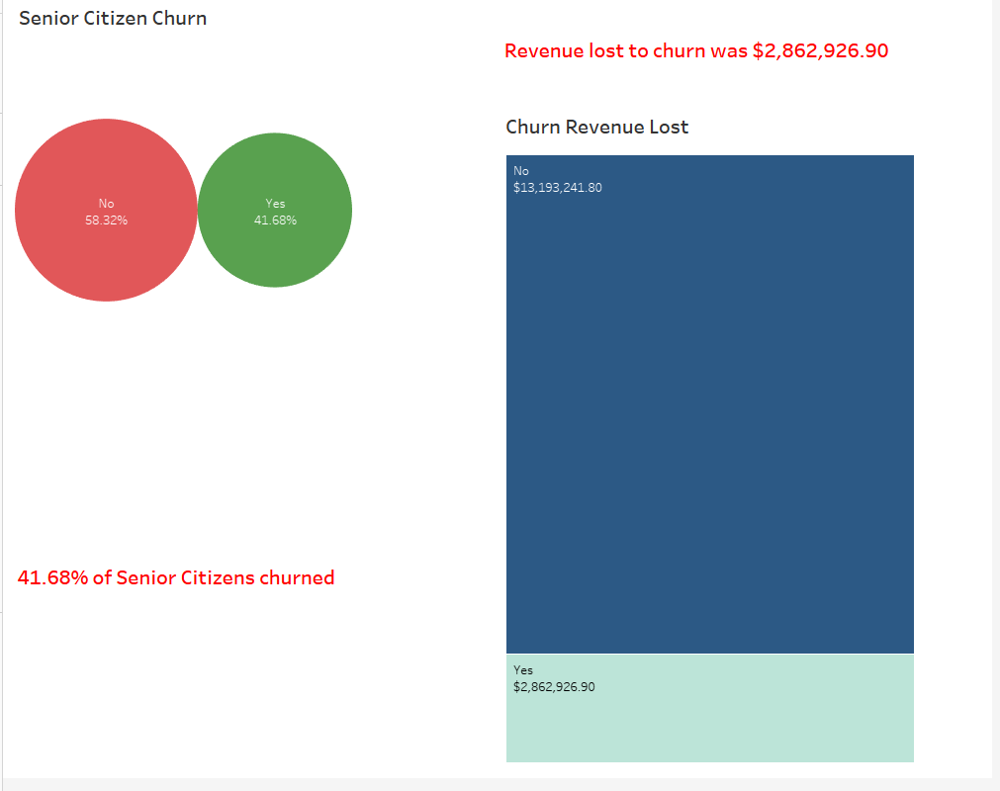

# Telco Customer Churn Predictive Analysis

## Project Overview

Telco, a telecommunications company, has assigned us to perform a predictive analysis based on established data, with the goal of identifying future customer churn trends. In addition to the historical data, we used multiple statistical algorithms and build predictive models to identify the probability of future outcomes. We presented our findings via Google slides with various types of pragmatic visuals in order to comprehensively convey our results. This analysis will provide Telco with the necessary insights to improve upon existing marketing and operational processes, reduce customer churn, and increase profits.

## Presentation

- <ins>Topic:<ins>

  Telco Customer Churn Predictive Analysis
  
- <ins>Reason for topic selection:<ins>

  Team members' nterests in marketing, customer relations, and sales.

- <ins> Question to answer: <ins>

  - What is the likelihood of future customer churn?
  - What customers are more likely to churn?
  - What customers are less likely to change companies?
	
- <ins> Benefits of the analysis:<ins>
	
  - Marketing optimization 
  - Operational improvement
  - Cost reduction
  - Profit maximization

- <ins>Customer churn definition:<ins>

  In layman’s terms, customer churn is the percentage of customers who have stopped using the company’s products and services over a specified amount of time.

- <ins> Data exploration:<ins>
	
  - Data: 21 columns and 7043 rows
  - Database vs CSV
  - CSV is a flat file, sequential	
  - Database is consistent and reliable data
	

- <ins> Exploratory Data Analysis:<ins>

	
- <ins> Data analysis: <ins>

  -Models: Logistic Regression, Decision Tree, XGBoost

## Results

<ins>Churn per contract lenght<ins>

	

<ins>Churn per gender<ins>

	

<ins>Churn per seniors, total lost revenue<ins>

	
	
	
## Dashboard
[Google Slides](https://docs.google.com/presentation/d/1a7xHa3yW0jl9KiDPbGxgLm1qyTQPn5KVI-QT3nqyuqM/edit?usp=sharing)

## Resources
- Data Source: [WA_Fn-UseC_-Telco-Customer-Churn.csv](https://github.com/UCF-Data-Analytics-Group-Project/Final_Project/blob/Cindy_T/WA_Fn-UseC_-Telco-Customer-Churn.csv)
-	Software: Pandas Library, Matplotlib, Numpy, Plotly, PostgreSQL, Python, Scikitlearn, Sqlalchemy, Tableau

## Team Details

- <ins>Communication protocol:<ins>
  - Team members only communication channels: SMS messages, Slack, Zoom
  - Project management tool: Jira 
  - Contact information shared: individual mobile phone numbers and email addresses
  - Regularly scheduled meetings 
	
	
- <ins>Team members:<ins>

  - Hunter Valentine
  - Husam Qarawi
  - Christ Stell
  - Cindy Toussaint
  - Hunter Valentine

