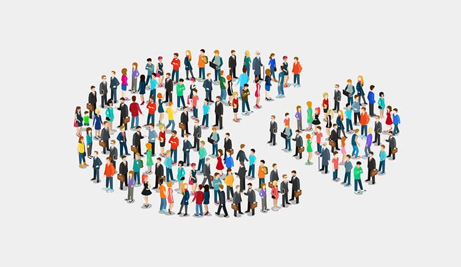

# Predicting Churn for Bank Customers

## Introduction

Customer Churn is defined as the percentage of customers that stopped using your company's product or service during a certain time frame. It's important because it costs more to acquire new customers than it does to retain existing customers. The data we are analyzing was found on Kaggle. It consists of data about specific customers and most importantly a column that allows us to know if the customer exited or stayed with the bank. With this data, we used Machine learning to create models to predict future customer churn.

## Results

## Summary

### Reducing Customer Churn

1. Focus your attention on your best customers. It could be even more beneficial to pool your resources into your loyal, profitable customers.

2. Analyze churn as frequently as you can. Use your churned customers as a means of understanding why customers are leaving.
4. Show your customers that you care.
5. Offer more rewards or create a new rewards program.

